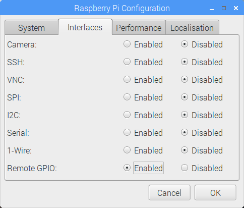

With the `gpiozero` Python module you can remotely control the GPIO pins on a Raspberry Pi via another computer.

- The first step is to enable **Remote GPIO** on the Raspberry Pi you want to access remotely. To do this, click on **Menu** > **Preferences** > **Raspberry Pi Configuration**. Then enable the **Remote GPIO** option:

	

- On the remote Raspberry Pi, you also need to be running the **pigpio daemon**. You can start it by typing the following into a terminal window:

  ```bash
  sudo pigpiod
  ```

- If you want this to be running on boot, then you can use this command instead:

	```bash
	sudo systemctl enable pigpiod
	```

- You can now remotely control the GPIO pins on this Raspberry Pi from any computer on which `gpiozero` is installed.

- On the computer with which you want to control the remote Pi, you first need to import the device you want to use in `gpiozero`, as well as the `PiGPIOFactory`.

	```python
	from gpiozero import LED
	from gpiozero.pins.pigpio import PiGPIOFactory
	```

- You now need to state the IP address of the remote Raspberry Pi. Replace the `192.168.1.100` in the code below with the IP address of your remote Raspberry Pi.

	```python
	rem_pi = PiGPIOFactory(host="192.168.1.100")
	```

- You can now create your devices and control them - just pass in the pin number you wish to control.

	```python
	led = LED(rem_pi(17))
	led.blink()
	```


